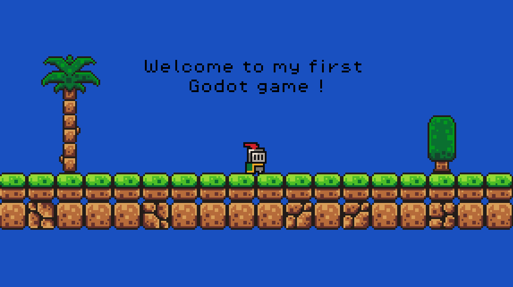
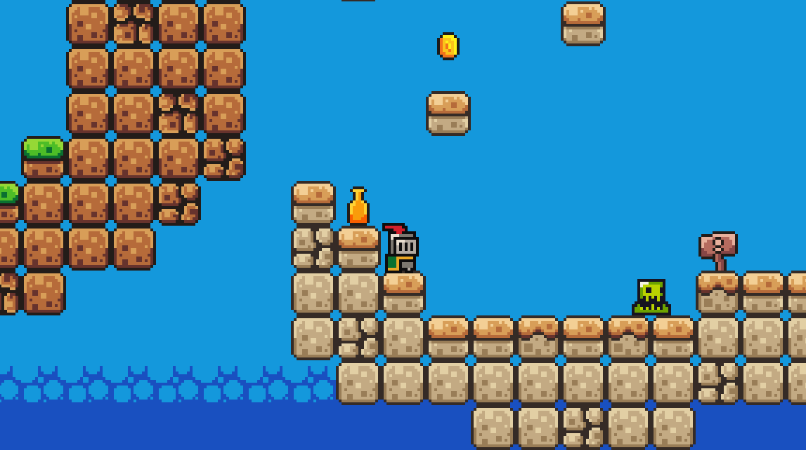
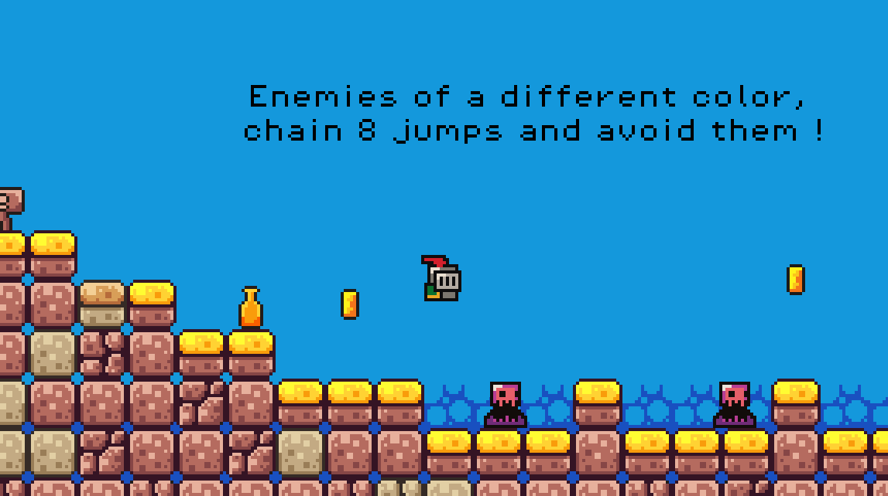
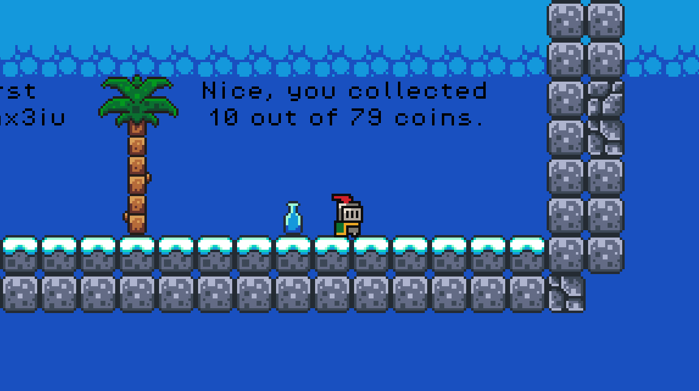

<!-- |-------------------------------------------------------------------------------------------| -->
<!-- |                                         LANGUAGE                                          | -->
<!-- |-------------------------------------------------------------------------------------------| -->
<div align="right">
  <a href="README.fr.md">
    
  </a>
  <a href="README.en.md">
    
  </a>
</div>

<!-- |-------------------------------------------------------------------------------------------| -->
<!-- |                                          HEADER                                           | -->
<!-- |-------------------------------------------------------------------------------------------| -->
<h1 align="left">🎮 First-Godot-Game</h1>

<p align="justify">
Mon premier jeu sur Godot est un jeu de plateforme où l'on incarne un petit chevalier traversant divers mondes et environnements. Pour réussir, le joueur doit esquiver ennemis et pièges, calculer ses sauts pour ne pas tomber dans le vide, et ramasser un maximum de pièces pour battre son record. Saurez-vous relever le défi ?
</p>

<!-- |-------------------------------------------------------------------------------------------| -->
<!-- |                                        APERÇU                                             | -->
<!-- |-------------------------------------------------------------------------------------------| -->
## 📸 Aperçu

**Image du début du jeu :**
<div align="center">
  
</div>
<br>

**Image du deuxième monde :**
<div align="center">
  
</div>
<br>

**Image du troisième monde :**
<div align="center">
  
</div>
<br>

**Image de l'arrivée :**
<div align="center">
  
</div>
<br>

<!-- |-------------------------------------------------------------------------------------------| -->
<!-- |                                        UTILISATION                                        | -->
<!-- |-------------------------------------------------------------------------------------------| -->
## 🎮 Lancer le jeu

<p align="justify">
Pour lancer le jeu, vous devez aller dans le dossier exports et double-cliquer sur le fichier. Si le système refuse de lancer l'application, ouvrez votre terminal dans le dossier exports et saisissez la commande suivante pour lui accorder les permissions d'exécution :
</p>

```bash
chmod +x First Godot Game.x86_64
```
<br>

<!-- |-------------------------------------------------------------------------------------------| -->
<!-- |                                    STRUCTURE DU PROJET                                    | -->
<!-- |-------------------------------------------------------------------------------------------| -->
## 📁 Structure du projet

```text
First-Godot-Game/
├── assets/                  # Ressources du jeu
├── exports/                 # Versions exportées du jeu
├── images/                  # Images utilisées dans le README
├── scenes/                  # Scènes Godot
├── scripts/                 # Scripts GDScript
├── default_bus_layout.tres  # Configuration audio
├── export_presets.cfg       # Configuration des exports
├── icon.svg                 # Icône du jeu
├── icon.svg.import          # Fichier d'import de l'icône
└── project.godot            # Configuration du projet Godot
```

<!-- |-------------------------------------------------------------------------------------------| -->
<!-- |                                       CONTRIBUTEURS                                       | -->
<!-- |-------------------------------------------------------------------------------------------| -->
## 👥 Contributeurs

Travail réalisé individuellement dans le cadre d'un projet personnel.

<div align="center">

[](https://github.com/rmax3iu)

</div>
